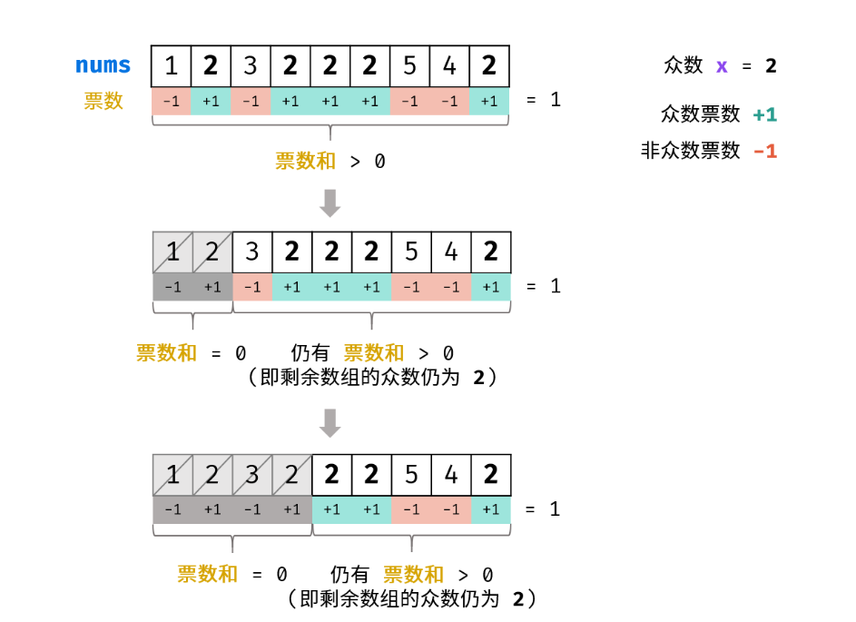
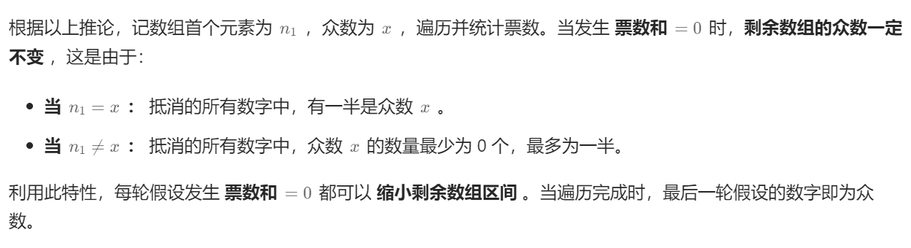
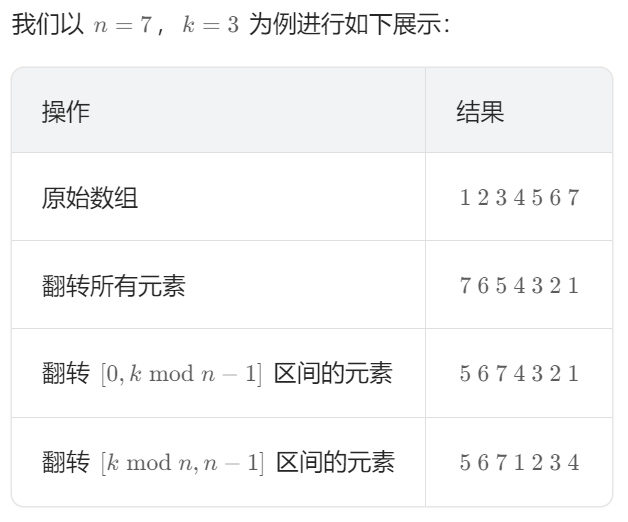

# 1 数组与字符串

## 合并两个有序数组(88.)

思想：  
采用倒序双指针  
1.分别初始化三个指针p1=len(nums1)-1、p2=len(nums2)、p=len(nums1)+len(nums2)-1;  
2\. nums1与nums2倒序遍历；  
3\. 然后它nums1的元素与nums2的元素进行比较，把大的值放入nums1最后面没有元素的地方；  
4\. 如果nums1的元素大，将nums1的元素移动到nums1最末尾空值的地方，则p1和p减1，如果nums2的元素大，将nums2的元素移动到最num1最末尾空值的地方，则2和p减1；  
5\. 循环1-4的步骤，当nums2的元素都合并到nums1中，p2<0时，结束；

```python
class Solution:
    def merge(self, nums1: List[int], m: int, nums2: List[int], n: int) -> None:
        """
        Do not return anything, modify nums1 in-place instead.
        """
        # 初始化指针
        p1, p2, p = m-1, n-1, m+n-1

        # 开始循环比较
        while p2 >= 0:
            if p1 >= 0 and nums1[p1] > nums2[p2]:
                nums1[p] = nums1[p1]
                p1 -= 1
            else:
                nums1[p] = nums2[p2]
                p2 -= 1
            p -= 1
```

## 移除元素(27.)

概述：  
给你一个数组nums和一个值val，你需要原地移除所有数值等于val的元素，并返回移除后数组的新长度。  
不要使用额外的数组空间，你必须仅使用O(1)额外空间并原地修改输入数组。元素的顺序可以改变。你不需要考虑数组中超出新长度后面的元素。  
示例：  
输入：nums = \[3,2,2,3\], val = 3  
输出：2, nums = \[2,2\]解释：函数应该返回新的长度 2, 并且 nums 中的前两个元素均为 2。你不需要考虑数组中超出新长度后面的元素。例如，函数返回的新长度为 2 ，而 nums = \[2,2,3,3\] 或 nums = \[2,2,0,0\]，也会被视作正确答案。

思想：  
采用双指针，（快慢指针）

- 快指针寻找新数组元素，新数组元素不等与目标元素
- 慢指针，用于元素的更新
- 快慢指针从数组起始开始遍历，当遇到与目标函数相等函数时，快指针继续往后遍历，慢指针在原地，等待更新，
- 当快指针遇到不等于目标元素的元素时，与慢指针指向的元素进行交换，然后慢指针继续往后遍历；
- 重复1-4的步骤

实现程序：

```python
class Solution:
    def removeElement(self, nums: List[int], val: int) -> int:
        p1 = 0
        p2 = 0
        while p2 < len(nums):
            if nums[p2] != val:
                nums[p1] = nums[p2]
                p1 += 1
            p2 += 1 
        return p1
```

## 删除有序数组中的重复项(26.)

给你一个 非严格递增排列 的数组 nums ，请你 原地 删除重复出现的元素，使每个元素 只出现一次 ，返回删除后数组的新长度。元素的 相对顺序 应该保持 一致 。然后返回 nums 中唯一元素的个数。  
考虑 nums 的唯一元素的数量为 k ，你需要做以下事情确保你的题解可以被过：

- 更改数组 nums ，使 nums 的前 k 个元素包含唯一元素，并按照它们最初在 nums 中出现的顺序排列。nums 的其余元素与 nums 的大小不重要。
- 返回 k ;

解题思路：

- 利用快慢指针；
- 首先定义两个连个变量p1、p2分别指向nums数组初始位置；
- 然后p2向后移动，当遇到相同元素时，p2一直向后移动；
- 当遇到不相同的元素时，p2位置的元素覆盖p1+1位置的元素，p1向前移动一步；
- 重复上述步骤；

实现程序：

```python
class Solution:
    def removeDuplicates(self, nums: List[int]) -> int:
        p = len(nums)
        # 定义两个指针p1、p2
        p1, p2 = 0, 0

        while p2 < p:
            if nums[p2] != nums[p1]:
                nums[p1+1] = nums[p2]
                p1 = p1 + 1
            p2 = p2 + 1
        
        return p1 + 1
```

## 删除有序数组中的重复项 II(80.)

描述：  
给你一个有序数组 nums ，请你 原地 删除重复出现的元素，使得出现次数超过两次的元素只出现两次 ，返回删除后数组的新长度。

不要使用额外的数组空间，你必须在 原地 修改输入数组 并在使用 O(1) 额外空间的条件下完成。

解题思路：

- 利用快慢双指针；
- 定义两个指针变量p1、p2，还有标记变量tag；
- 两个指针分别指向元素位置，标记变量tag用来记录相同元素个数；
- 首先p1、p2指向nums数组初始位置，tag=1；
- p1向后移动，当遇到与p2指向位置的元素的相等元素时，tag+1；
- p1继续向后移动，当tag=2时，表示与p2位置相关元素的个数为2时，p2指针跳转到p1位置；
- p1继续向后移动，当p1指向的元素与p2指向的元素不同时，p1指向的元素覆盖p2+1位置的元素，p2更新位置p2+1，tag更新为p=1
- 重复上述步骤

本题的解题思路与上题的解题思路相似，也是利用了快慢双指针，在此基础上利用tag标记变量；

实现程序：

```python
class Solution:
    def removeDuplicates(self, nums: List[int]) -> int:
        '''定义两个指针变量p1、p2，和一个标记变量tag'''
        p1, p2, tag = 0, 0, 1

        # 开始循环删除重复数据
        while(p1 < len(nums)):
            if nums[p1] != nums[p2]:
                nums[p2+1] = nums[p1]
                p2 += 1
                tag = 1
            if tag == 2:
                nums[p2+1] = nums[p1]
                p2 += 1
            p1 += 1
            tag += 1
        
        return p2 + 1
```

这种实现方法运行速度为51ms

另一种实现方法：

```python
class Solution:
    def removeDuplicates(self, nums: List[int]) -> int:
        n = len(nums)
        if n <= 2:
            return n

        slow, fast = 2, 2
        # 开始循环删除重复数据
        while fast < n:
            if nums[slow-2] != nums[fast]:
                nums[slow] = nums[fast]
                slow = slow + 1
            fast = fast + 1
        return slow
```

这种方法运行速度为40ms

## 多数元素(169.)

描述：  
给定一个大小为 n 的数组 nums ，返回其中的多数元素。多数元素是指在数组中出现次数 大于 ⌊ n/2 ⌋ 的元素。

你可以假设数组是非空的，并且给定的数组总是存在多数元素。

摩尔投票：

- 设输入数组 nums 的众数为 x ，数组长度为 n 。
- 推论一： 若记 众数 的票数为 +1 ，非众数 的票数为 −1 ，则一定有所有数字的 票数和 >0。
- 推论二： 若数组的前 a个数字的 票数和 =0 ，则 数组剩余 (n−a)(n-a)(n−a) 个数字的 票数和一定仍 >0 ，即后 (n−a) 个数字的 众数仍为 x  
      
    

解决思路：

- 利用摩尔投票法
- \[诸王争霸赛开始\]投票规则为：目前投票数为0的话换候选人，遇到自己人进行投票，遇到敌人减票
- 首先随机选取一个候选霸王，初始票数为1
- 遇到自己帮派的人，票++
- 遇到敌人，票--，

实现程序：

```python
class Solution:
    def majorityElement(self, nums: List[int]) -> int:
        num = nums[0] # 我先来当霸王
        cnt = 1 # 目前帮派就我一个人，遍历下去看看还有没有自己人为自己撑腰打气，首先遇到对手就被搞下去了
        for i in range(1, len(nums)):
            if num == nums[i] :
                cnt += 1 # 帮派的人来撑腰了，票数++
            else:
                cnt -= 1 # 敌方来骚扰我当霸王，票数--
                if cnt == 0: # 没了，目前帮派人不够地方多，话语权没有
                    num = nums[i] # 换霸王
                    cnt = 1 # 新的霸王重新计数
        
        # 选出来笑到最后的霸王
        return num;
```

## 轮转数组(189.)
给定一个整数数组 nums，将数组中的元素向右轮转 k 个位置，其中 k 是非负数。
### 第一种方法（使用额外空间的数组）
算法思路：
- 利用一个list空间，存储轮转后的元素
- 通过计算公式：index = (listSize - k + i) % listSize算出元素轮转后的位置；
- 通过index访问原始数组，将元素放入新的数组
- 然后将利用新数组list，覆盖原数组

```python
# 第一方法利用一个list空间进行计算
list_new = []
listSize = len(nums)
for i in range(listSize):
    list_new.append(nums[((listSize - k + i) % listSize)])
            
 # 对原数组进行覆盖
for i in range(listSize):
    nums[i] = list_new[i]
```
### 第二方法（翻转数组法）
算法思路：
- 该方法基于如下的事实：当我们将数组的元素向右移动 k次后，尾部 k mod n个元素会移动至数组头部，其余元素向后移动 k  mod  n个位置。
- 该方法为数组的翻转：我们可以先将所有元素翻转，这样尾部的 k mod nk\bmod nkmodn 个元素就被移至数组头部，然后我们再翻转 (0, k  mod  n −1) 区间的元素和 (k  mod  n, n−1) 区间的元素即能得到最后的答案。

```pyhton
    # 翻转元素函数
    def swap(self, nums, start, end):
        temp = nums[start]
        nums[start] = nums[end]
        nums[end] = temp

    # 翻转数组函数
    def reverse(self, nums, start, end):
        while start < end:
            self.swap(nums, start, end)
            start = start + 1
            end = end - 1

    def rotate(self, nums: List[int], k: int) -> None:
        """
        Do not return anything, modify nums in-place instead.
        """

        # 第二方法，翻转数组法
        k = k % len(nums)
        self.reverse(nums, 0, len(nums)-1)
        self.reverse(nums, 0, k-1)
        self.reverse(nums, k, len(nums)-1)
```
## 买卖股票的最佳时机(121.)
### 第一种方法
解题思路：
- 定义两个临时变量，temp1存储当前最小元素，temp2存储当前最大利润；
- 循环遍历数组；
- 当遍历到的元素比temp1（当前最小值）小，则更新temp1；
- 当遍历到的元素比temp1大，计算当前元素与当前最小元素的差值，如果差值比temp2（当前最大利润）大，则更新temp2；
```python
import sys
class Solution:
    def maxProfit(self, prices: List[int]) -> int:
        # 定义两个临时变量
        temp_min_ele = sys.maxsize
        temp_max_price = 0
        for ele in prices:
            if ele < temp_min_ele:
                temp_min_ele = ele
            else:
                dif_value = (ele - temp_min_ele)
                if temp_max_price < dif_value:
                    temp_max_price = dif_value
        return temp_max_price
```
## 买卖股票的最佳时机 II(122.)
给你一个整数数组prices ，其中prices[i]表示某支股票第i天的价格;
在每一天，你可以决定是否购买和/或出售股票。你在任何时候最多只能持有 一股股票。你也可以先购买，然后在 同一天 出售;
返回 你能获得的 最大 利润 ;

### 第一种（贪心法）
解题思路：
- 利用贪心法
- 当股票价格下降时就在前一天卖出（选择当前最优）
```python
import sys
class Solution:
    def maxProfit(self, prices: List[int]) -> int:
        # 利用贪心法
        # 当股票价格下降时就在前一天卖出（选择当前最优）
        res = 0
        min = prices[0]
        count = 0
        for i in range(1, len(prices)):
            if prices[i] < prices[i-1]:
                res = res + (prices[i-1] - min)
                min = prices[i]
                continue
            if i == (len(prices)-1):
                res = res + (prices[i] - min)
        
        return res
```

### 第二种方法（动态规划法）
